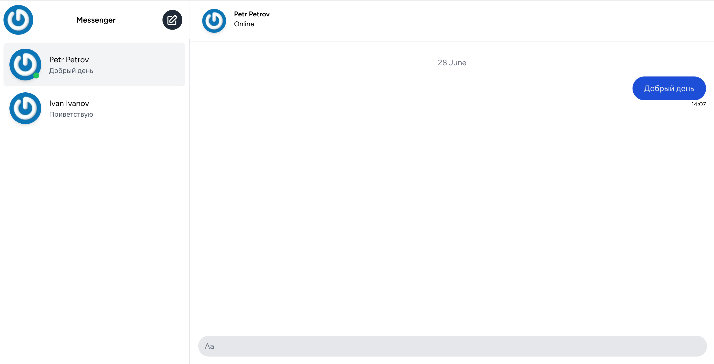

# Введение

Приложение **Messenger** представляет собой реализацию чата между пользователями для обмена сообщениями в реальном времени. 

Зарегистрированные пользователи могут:
- Добавлять других пользователей в свой список контактов;
- Отправлять сообщения другим пользователям;
- Получать сообщения от других пользователей.

Приложение создано в рамках курса [Laravel 10 Vue 3 Inertia SPA Вебсокет чат](https://laravelcreative.ru/course/4).

---
