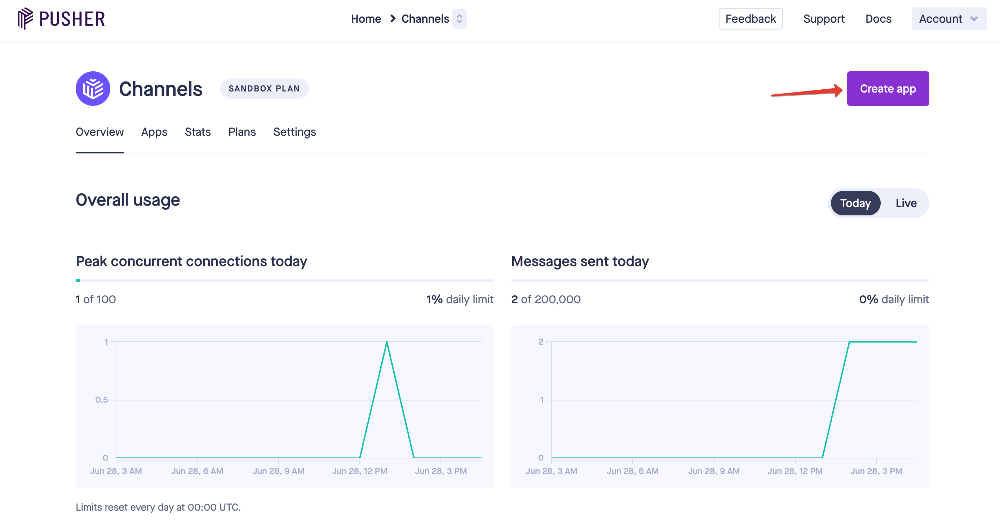
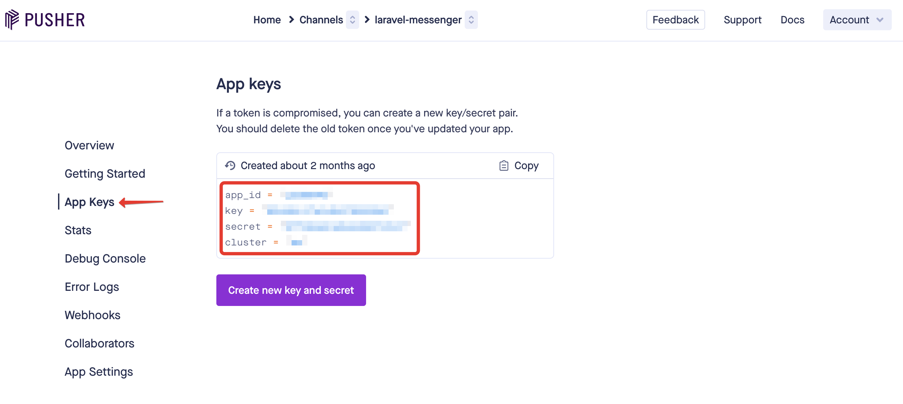

# Настройки

Для обмена сообщениями между пользователями в реальном времени используется технология **Websocket** и сервис [Pusher](https://pusher.com).

После регистрации в этом сервисе необходимо создать новое приложения в кабинете пользователя - https://dashboard.pusher.com/channels

И создать новое приложение:



Затем, потребуется взять ключи доступа от нового приложения:



И добавить их в соответствующие поля файла `.env`:

```
PUSHER_APP_ID=
PUSHER_APP_KEY=
PUSHER_APP_SECRET=
PUSHER_APP_CLUSTER=
```
