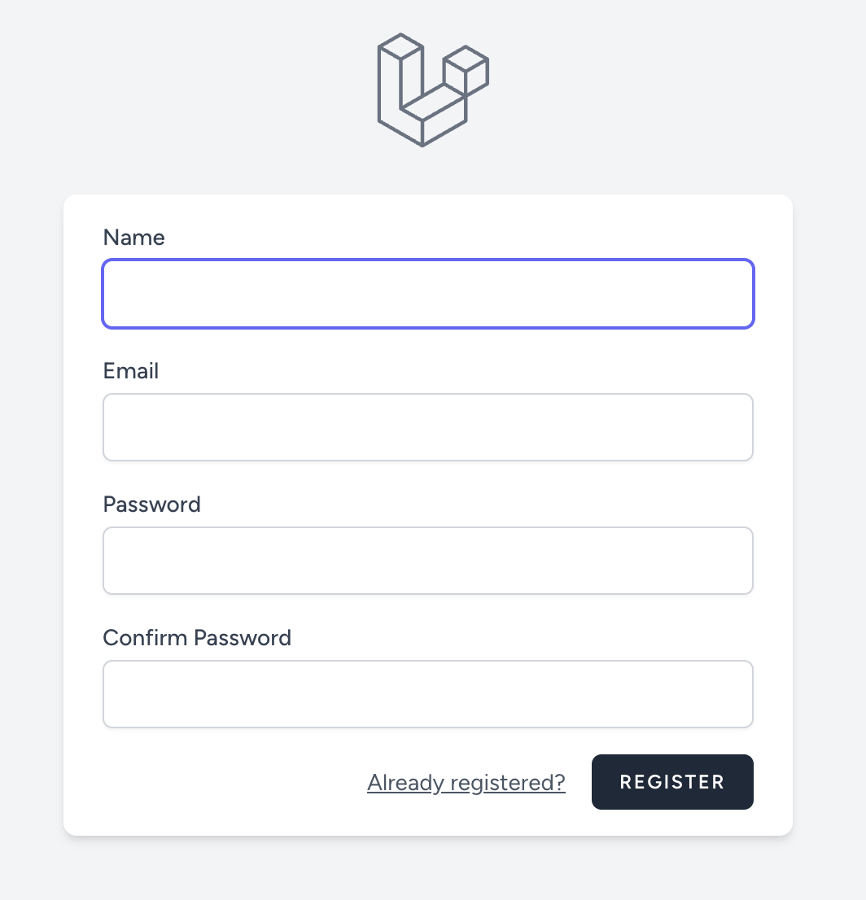
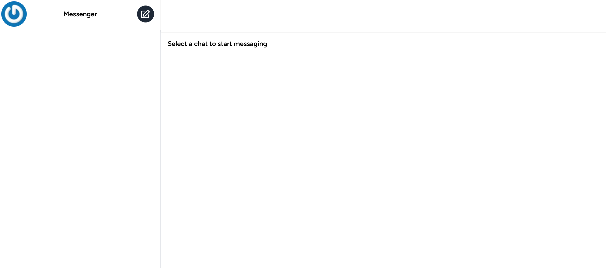

# Регистрация

Ссылка на регистрацию:

http://localhost:8080/register

По клику открывается отдельная страница с формой:

* **Name** - произвольное имя пользователя
* **Email** - email пользователя, должен быть уникальным
* **Password** - пароль пользователя, длина не менее 8 символов
* **Confirm Password** - подтверждение пароля пользователя, должно быть равно значению в предыдущем поле

Все поля обязательны для заполнения.

После завершения процесса регистрации пользователь будет аутентифицирован и переадресован на главную страницу приложения:

---

[<< Запуск](../04-start/README.md) | [Аутентификация >>](../06-login/README.md) | [**К оглавлению**](../README.md)

