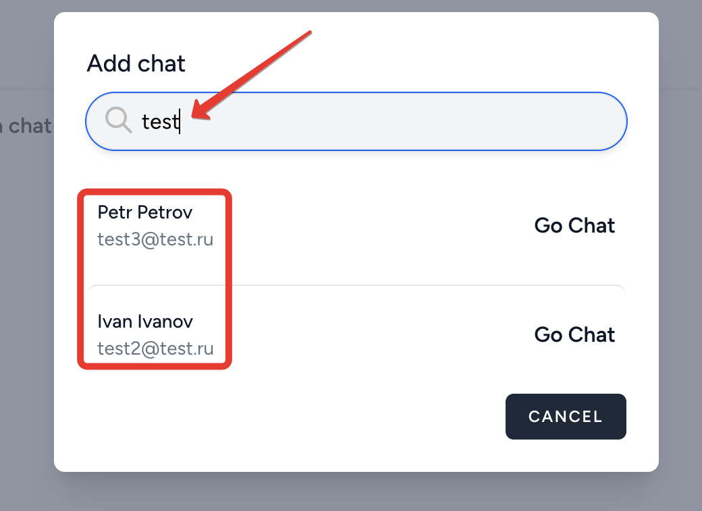
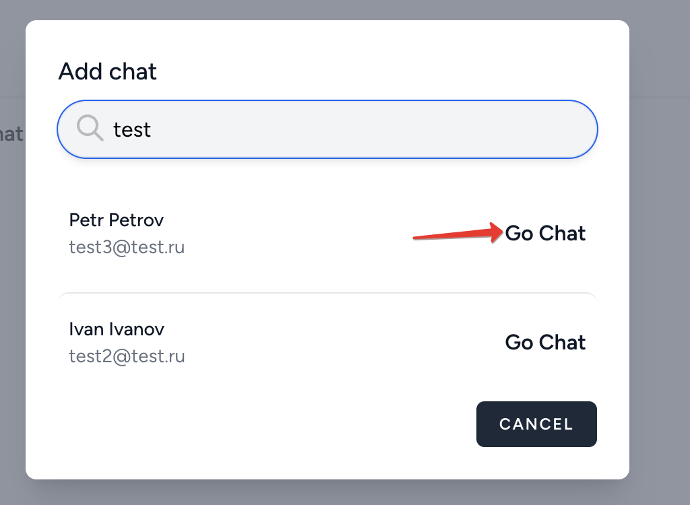

# Добавление контактов

По-умолчанию список контактов пользователя пуст:

Необходимо добавить других пользователей, чтобы начать общение:

Требуемого пользователя можно найти по email:

И начать с ним общение:

---

[<< Аутентификация](../06-login/README.md) | [Чат >>](../08-chat/README.md) | [**К оглавлению**](../README.md)
