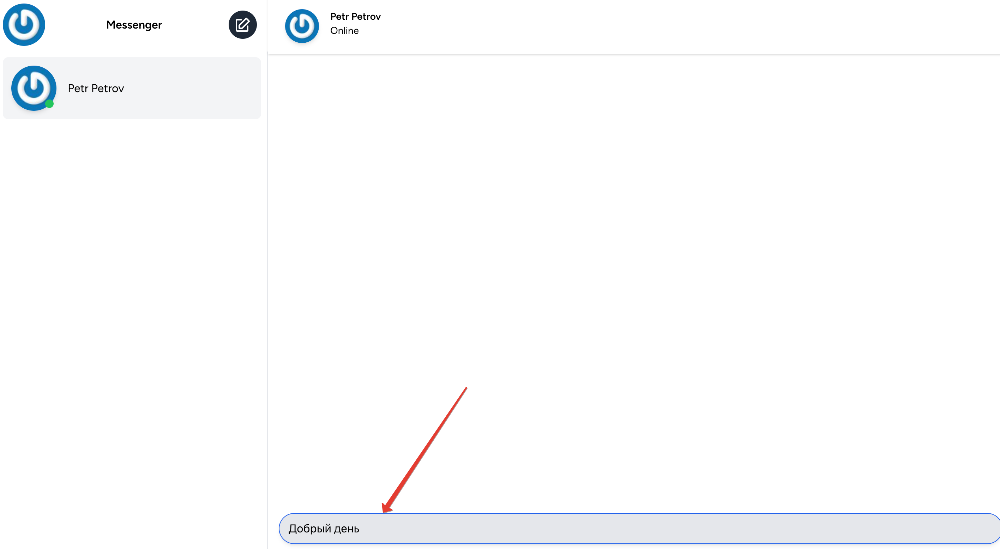
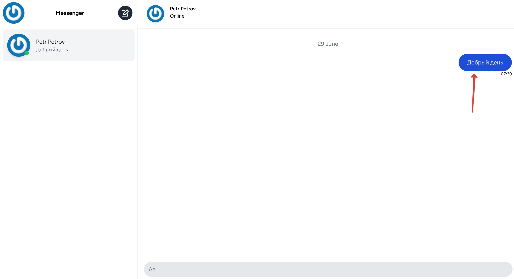

# Чат

После [добавления контакта](../07-add-contact/README.md) пользователя открывается страница переписки с конкретным пользователем:

Отправить сообщение можно через поле ввода (по нажатию *Enter*):

После отправки сообщение отобразится на странице переписки:

