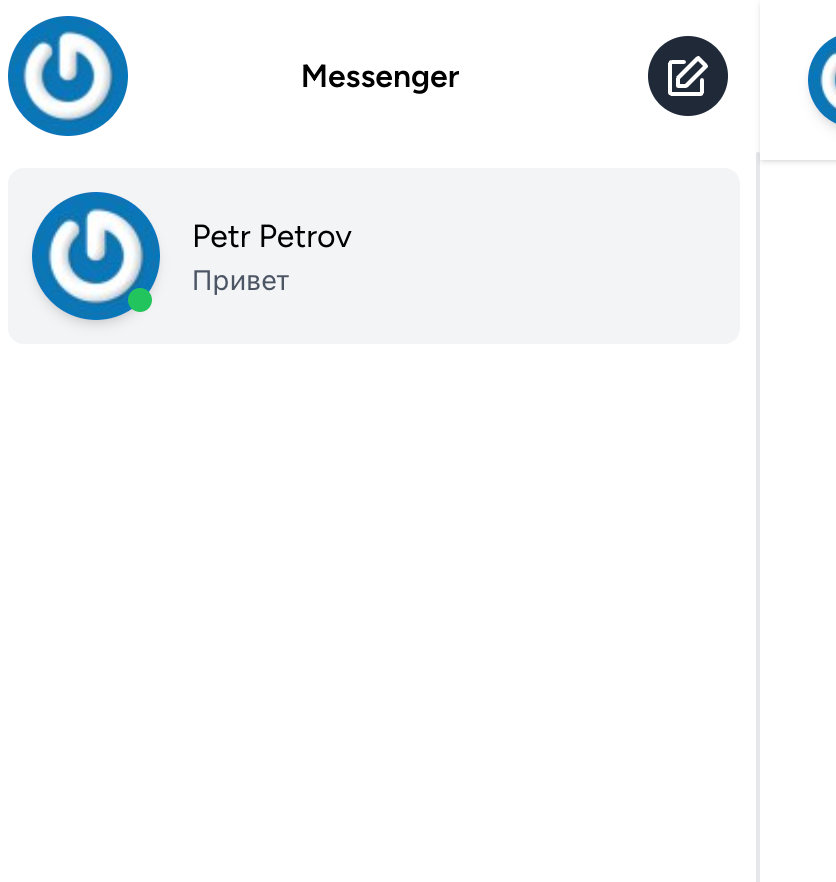
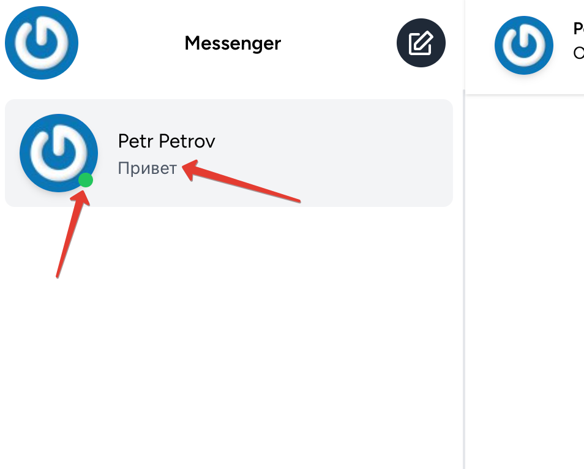

# Контакты

В левой части приложения всегда расположен список контактов пользователя. 
Он может быть пустым или содержать пользователей, с которыми уже были созданы чаты:

Для каждого чата отображается последнее сообщение в этом чате и статус пользователя, с которым создан этот чат (в сети или отсутствует):

---

[<< Чат](../08-chat/README.md) | [Профиль >>](../10-profile/README.md) | [**К оглавлению**](../README.md)
